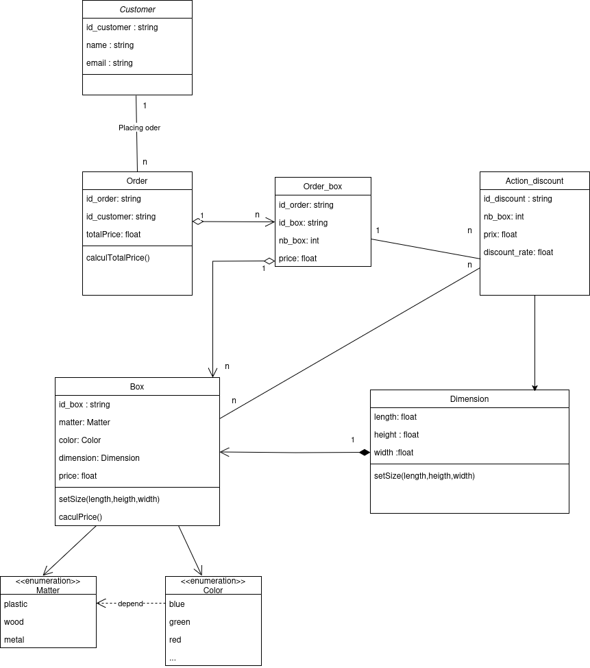

# BRIEF PROJET
**Ceci est un mini-projet de Simplon pour tester la candidature au programme Data Engineer.**

**1. Schéma**

**2. Detail de diagramme**

J’utilise un diagramme de classes pour concevoir les données. Il y a 8 classes, dont 2 classes Matter
et Color qui sont des énumérations représentant un ensemble d’attributs pour les options Matter
et Color. Il existe une relation de dépendance entre Color et Matter, où Matter aura différentes
couleurs. La classe Dimension est une classe avec 3 attributs pour la définir. De plus, il y aura
une fonction pour imposer des contraintes sur cet attribut. Les autres classes, telles que Customer,
Box, Order, Order_Box et Action_discount, sont créées en fonction des besoins de la base de
données

**3. Script SQL pour la création de la base de données**

j’ai utilisé PostgreSQL pour le script SQL. Le fichier "create_table.sql" est utilisé pour créer des tables, contenant des descriptions des syntaxes et des explications sur les conditions requises pour la création de la table.
